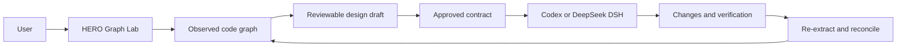

# HERO Graph Lab

HERO Graph Lab is a visual workspace for understanding a codebase, designing a
change as a graph, approving a versioned contract, and reconciling the result
with the real source tree and Git state.

It owns the observed graph, local design draft, contract, source snapshot,
verification policy, execution evidence, and the visual status of each change.
The coding agent is interchangeable: the current integrated agents are Codex
and the official [DeepSeek Harness (`dsh`)](https://github.com/deepseek-ai/deepseek-harness).



The legacy HERO Harness mission workflow is not part of the normal flow.

## Requirements

- Python 3.12 or newer.
- Git for contract acceptance status.
- One agent runtime:
  - Codex CLI for `--explore-provider codex`; or
  - Node 22.19+ and the official DeepSeek DSH CLI for `--explore-provider dsh`.

Install Graph Lab with its MCP dependency:

```bash
python3.12 -m venv .venv
.venv/bin/python -m pip install -e ".[mcp]"
```

On Windows, use `py -3.12`, `.venv\Scripts\python.exe`, and
`.venv\Scripts\hero-graph-lab.exe` instead.

## Run with Codex

Codex is the default chat agent:

```bash
cd ~/hero-graph-lab
.venv/bin/hero-graph-lab \
  --host 127.0.0.1 \
  --port 8765 \
  --mission-project "$PWD" \
  --explore-provider codex
```

Open <http://127.0.0.1:8765>. `--mission-project` selects the initial project
to index. Without it, Graph Lab opens its fixture and **Open project** can
select an absolute local path.

## Run with DeepSeek DSH

Install the official DeepSeek harness as your normal user, not with `sudo`:

```bash
npm install -g @deepseek-ai/dsh
dsh --version
```

Create `.env` from `.env.example` and set the API key:

```dotenv
DEEPSEEK_API_KEY=...
HERO_GRAPH_LAB_DSH_MODEL=deepseek-v4-flash
```

Then start Graph Lab:

```bash
cd ~/hero-graph-lab
.venv/bin/hero-graph-lab \
  --host 127.0.0.1 \
  --port 8765 \
  --mission-project "$PWD" \
  --explore-provider dsh
```

Do not use `DSH_MODEL` in `.env`: DSH intentionally rejects it. Graph Lab
translates `HERO_GRAPH_LAB_DSH_MODEL` into the process-only `DSH_MODEL` value.
It also generates `.graph-lab/dsh`, a local DSH profile that connects the
official DSH MCP client to the active Graph Lab server.

DSH headless runs one process per chat turn. Graph Lab retains the conversation
and supplies the relevant history and graph context to the next turn.

## Design and implementation flow

1. Ask the chat agent to inspect or change part of the project.
2. The agent reads graph and source evidence, then creates reviewable graph
   proposals. Proposals never write source files.
3. Inspect the proposal contract in the Code panel. It shows target paths,
   interface, requirements, acceptance criteria and direct relationships.
4. Approve the design in the chat.
5. Graph Lab snapshots the accepted draft, compiles and validates a contract,
   and exports a handoff to `.graph-lab/handoffs/<execution-id>/`.
6. Ask the active agent to implement it. It receives only the contract-owned
   paths and configured checks.
7. Graph Lab records evidence, re-extracts the project graph, and marks nodes
   and relationships as materialized. After a Git commit, applicable paths are
   marked accepted.

Changes outside the approved contract paths are reported as divergent; they are
not silently accepted. `.graph-lab/` is local runtime state and is ignored by
Git.

## Chat and graph interaction

The chat receives the current graph scope, selected node or relationship,
visible source range, visible nodes and pinned nodes. Press Enter to send a
message. Agent progress and replies stream into the conversation.

The **Mic** control uses browser speech recognition; **Read** toggles speech
output. Both disable gracefully when the browser lacks the corresponding Web
Speech API.

Assistant Markdown is sanitized with DOMPurify. Mermaid diagrams use a strict
security profile and invalid diagrams remain visible as controlled errors.

## Proposal contracts

Code-oriented proposals carry more than a label:

- repository-relative `target_path`;
- qualified name and callable signature;
- responsibility and docstring;
- linked requirements and behavioral acceptance criteria;
- explicit relationships to observed code.

A proposal without a concrete observed implementation connection remains
visibly incomplete. Graph Lab preserves missing values rather than inventing
them. Browser proposals and MCP proposals share the same vocabulary and merge
into the same draft.

## MCP server

Graph Lab exposes source, graph-query, proposals, contracts, handoffs,
execution evidence and reconciliation through an MCP STDIO server. The bridge
uses the Graph Lab loopback server, ensuring that tools always act on the
project selected in the UI.

Start Graph Lab first, then register it with Codex:

```bash
codex mcp add hero_graph_lab -- \
  /absolute/path/to/hero-graph-lab/.venv/bin/python \
  -m hero_graph_lab.mcp_server \
  --url http://127.0.0.1:8765
```

DeepSeek DSH receives the same MCP server automatically through its generated
`graph-lab` DSH profile; no separate MCP registration is required.

The MCP bridge accepts loopback URLs only. It does not expose an unrestricted
shell or a legacy mission worker.

## Graph navigation

Graph Lab offers three views over the same graph:

- **Hierarchy**: containment only.
- **Flow**: the navigated path, direct children and related context.
- **Focus**: callers and callees of the selected node.

Useful shortcuts while the graph has focus:

| Shortcut | Action |
| --- | --- |
| `I` | Ask the configured agent to explain the selected node. |
| `M` | Open Diagram Studio. |
| `G` | Open or expand an interactive projection. |
| `T` | Trace calls. |
| `F` | Open Focus view. |
| `→` / `←` | Expand/follow or collapse/back. |
| `C` | Toggle only-active graph context. |
| `H` | Hide the selected node. |
| `P` | Pin or unpin a node as chat context. |
| `A` / `R` | Add a proposed node or relationship. |
| `Delete` | Delete or restore the selected proposal. |
| `Ctrl+K` | Open the command palette. |

`G` opens a deterministic interactive projection. Diagram Studio supports
hierarchy, class, calls, module dependencies, neighborhood and pinned-path
views. The optional business-sequence diagram is always labelled `INFERRED`.

## API and execution status

The neutral HTTP API includes:

- `GET /api/capabilities`
- `GET /api/contracts`
- `GET /api/executions/<execution-id>`
- contract validation, handoff, evidence and reconciliation actions.

To inspect an execution from a terminal:

```bash
curl -s http://127.0.0.1:8765/api/executions/EXECUTION_ID | python3 -m json.tool
```

## Tests

Run the full suite:

```bash
.venv/bin/python -m pytest -q
node --test tests/*.test.js
```

The Python suite covers extraction, contracts, execution reconciliation, MCP,
server endpoints and agent adapters. The JavaScript suite covers graph
projection, navigation, rendering, views and panel layout.
