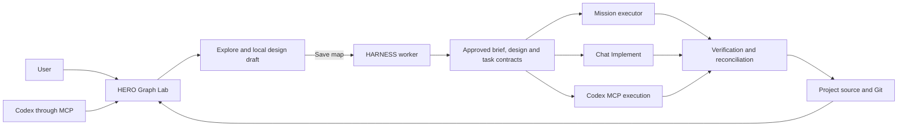

# HERO Graph Lab

HERO Graph Lab is the visual workspace for understanding a codebase, designing
changes and supervising implementation. It is the companion interface for
[HERO HARNESS](https://github.com/mikelval82/hero-harness), which owns the
mission workflow, approved contracts, execution evidence, verification and Git
transitions.

The two applications remain independently usable and process-isolated. Graph
Lab can explore code and prepare a local design without HARNESS; HARNESS can run
missions from its own CLI and listeners without Graph Lab. When used together,
Graph Lab starts a HARNESS worker subprocess and communicates with it only
through authenticated loopback HTTP/JSON. Graph Lab has no HARNESS imports, and
worker credentials never reach the browser.

## Run

Requires Python 3.12 or newer.

```powershell
py -3.12 -m venv .venv
.\.venv\Scripts\python.exe -m pip install -e .
.\.venv\Scripts\python.exe -m hero_graph_lab
```

Use the explicit `.venv` interpreter even when the terminal prompt already
shows `(.venv)`: another workspace environment may still own the `python`
command. The editable install means `PYTHONPATH` and changing into `src` are
not required.

Open <http://127.0.0.1:8765>.

To open a project directly and enable missions:

```powershell
.\.venv\Scripts\python.exe -m hero_graph_lab `
	--mission-project C:\path\to\project `
	--harness-root C:\path\to\HARNESS `
	--harness-python C:\path\to\HARNESS\.venv\Scripts\python.exe
```

`--mission-project` is both the initial graph source and the project bound to
HARNESS. Without it, Graph Lab opens the fixture and requires **Open project**
before a mission can start. Enter the absolute path of a folder on the machine
running Graph Lab. Changing projects is only allowed while no worker is running.

An empty selected folder is initialized as a Git repository with an initial
commit. A non-empty folder that is not already a Git repository is rejected so
Graph Lab cannot silently adopt existing files.

## How Graph Lab and HARNESS work together

Graph Lab owns the interactive experience: it extracts the observed code graph,
renders source and contracts, keeps reviewable design changes in a browser-local
draft and gives the user explicit controls for synchronization and execution.
HARNESS is the authority behind that experience: it stores approved design
revisions, compiles ChangeSets and WorkPlans, publishes immutable task contracts,
grants execution leases and decides completion from verifier evidence.



The integration has one direction of authority. **Save map** sends the reviewed
design draft to HARNESS; it does not make Graph Lab another contract store.
Mission, Chat and MCP may take turns implementing an approved task, but HARNESS
permits only one active execution lease for the mission. After implementation,
HARNESS runs the common verifier and reconciliation; Graph Lab then refreshes
the observed source graph and shows whether each contract is proposed,
divergent or materialized.

## Explore Assistant

The Inspector's **Explore** chat is available independently of HARNESS. Each
question includes the current graph scope, selected node or relationship,
visible source range, visible nodes, and any nodes pinned by the user. In
**Read** mode, the assistant can inspect the selected project with read-only
Read, Glob, Grep and graph-query tools and cannot modify project files.

The default deterministic provider verifies the interaction without requiring
credentials. Start Graph Lab with a model-backed provider using its standard
SDK environment variable (`ANTHROPIC_API_KEY`, `OPENAI_API_KEY`, `DEEPSEEK_API_KEY`, or
`GOOGLE_API_KEY`/`GEMINI_API_KEY`):

```powershell
.\.venv\Scripts\python.exe -m hero_graph_lab --explore-provider anthropic --explore-model claude-sonnet-4-5
.\.venv\Scripts\python.exe -m hero_graph_lab --explore-provider openai --explore-model gpt-5
.\.venv\Scripts\python.exe -m hero_graph_lab --explore-provider deepseek --explore-model deepseek-v4-flash
.\.venv\Scripts\python.exe -m hero_graph_lab --explore-provider gemini --explore-model gemini-2.5-flash
```

Install one provider with `.\.venv\Scripts\python.exe -m pip install -e
".[anthropic]"`, `.\.venv\Scripts\python.exe -m pip install -e ".[openai]"`,
`.\.venv\Scripts\python.exe -m pip install -e ".[deepseek]"`, or
`.\.venv\Scripts\python.exe -m pip install -e ".[gemini]"`; `.[explore]`
installs all providers. On Windows, `run-gemini.cmd` starts Gemini with the local
interpreter and accepts additional Graph Lab arguments. Provider adapters only
translate the common model and tool-call contract, so additional clients can
be added without changing the assistant service or UI.

HARNESS can route mission phases across model tiers independently of the
Explore assistant. With DeepSeek, leave `HARNESS_MODEL` unset to use V4 Flash
for routine phases and V4 Pro for planning, high-confidence review, large tasks
and retries. Override the tiers with `HARNESS_MODEL_CHEAP`,
`HARNESS_MODEL_DEFAULT`, and `HARNESS_MODEL_DEEP`; the Mission activity panel
shows each selected model.

The **Mic** control dictates into the current Explore question using the
browser's speech-recognition service. **Read** toggles spoken assistant replies.
Voice input and output degrade to disabled controls when the browser lacks the
corresponding Web Speech API; the Gemini key remains server-side and audio is
never sent through Graph Lab's HTTP API.

Explore renders assistant Markdown through the same sanitized renderer used by
Mission documents. HTML is sanitized with DOMPurify, Mermaid uses its strict
security profile, and invalid diagrams remain visible as controlled errors.

In **Propose** mode, the assistant can emit reviewable module, class, function,
method, and relationship proposals. Accepted actions are saved automatically in
the browser-local design draft and never edit project source files. **Save map**
is the separate explicit step that synchronizes the draft to HARNESS.

### Connected proposal contracts

A proposal is more than a labelled box. Code-oriented proposal nodes can carry
the exact intended path, qualified name, callable signature, responsibility,
docstring, linked requirements, and behavioral acceptance criteria. Selecting a
proposal opens **Proposal Contract** in the Code workspace. This view renders a
clearly labelled virtual interface, lists its direct relationships and observed
implementation anchors, and reports missing contract fields. It never presents
the preview as repository source or creates a source stub.

Connections to current code are explicit reviewed graph relationships. A
proposal connected only to the project root remains visibly incomplete because
root containment explains placement, not integration. The editor and agents may
leave fields unresolved when evidence is insufficient; Graph Lab preserves the
draft and reports the omissions instead of inventing code details. Existing
legacy proposals continue to load and are shown with the same completeness
diagnostics.

The Add/Edit dialog, Explore chat, and `ProposeNode` MCP tool use the same
contract vocabulary. Browser storage preserves the enriched local draft across
reloads. **Save map** sends those fields unchanged to HARNESS, where approval,
task slicing, execution leases, and verification remain authoritative.

**Implement** is a separate, explicit authorization mode. It is available only
when HARNESS exposes an approved pending task contract and no Mission or MCP
executor owns the lease. Chat must read that exact contract, acquire the lease,
touch only contract-owned paths through hash-guarded patches, run the checks
selected by HARNESS and finish by completing the task, reporting a blocker or
requesting an amendment. Natural-language wording alone never enables source
writes.

## Codex MCP tools

Graph Lab can expose the same source, graph-query, proposal and active-contract
control planes as an MCP STDIO server for local Codex clients. The browser
Explore chat remains on its existing REST session API; both adapters use the
same Graph Lab project, while HARNESS remains the authority for contract state.

Install the optional SDK dependency:

```powershell
.\.venv\Scripts\python.exe -m pip install -e ".[mcp]"
```

Start the Graph Lab web server first. The MCP bridge deliberately delegates to
the loopback server so its tools always use the project currently selected in
the UI:

```powershell
codex mcp add hero_graph_lab -- `
  C:\path\to\hero-graph-lab\.venv\Scripts\python.exe `
  -m hero_graph_lab.mcp_server `
  --url http://127.0.0.1:8765
codex mcp list
```

Restart the Codex IDE extension after adding the server. Inspection tools are
marked read-only; `ProposeNode` and `ProposeRelation` are marked as writes. MCP
proposals enter an in-memory delivery inbox and the open browser applies them
to the existing local design draft. They remain `NEW` reviewable elements and
still require **Save map** for HARNESS synchronization.

`ProposeNode` accepts `target_path`, `qualified_name`, `signature`, `docstring`,
`description`, `satisfies`, and `acceptance` in addition to its label, kind, and
optional parent. Paths must be repository-relative. Callers should inspect the
observed graph first and add an explicit justified relationship to current code;
unknown contract details should be omitted and will remain visibly incomplete.

When an approved mission is active, Codex can also list and retrieve immutable
task contracts, acquire the `mcp` execution lease, validate, complete, report a
blocker or request an amendment. Codex continues to edit and test with its
native contained workspace tools; MCP supplies the pinned contract and records
lifecycle evidence rather than exposing a second filesystem or unrestricted
shell. Contract state is stored only by HARNESS and survives Graph Lab or MCP
client restarts according to the worker mission state.

The bridge accepts loopback HTTP URLs only. If Graph Lab is stopped, tool calls
fail explicitly instead of extracting a different or stale project. Pending
delivery state is intentionally ephemeral and is cleared when the server stops
or the selected project changes.

## Graph commands

Graph actions are registered once and invoked by toolbar buttons, keyboard
shortcuts, and the `Ctrl+K` command palette. A command owns its availability,
so its button and palette state remain synchronized. Graph shortcuts
only run while the graph has focus and are ignored in form fields, editable
content, and open dialogs.

| Shortcut | Command |
|---|---|
| `I` | Ask the configured Explore provider for a Spanish explanation of the selected node |
| `M` | Open Diagram Studio for deterministic diagrams or an inferred business sequence |
| `G` | Open a contextual interactive projection in Flow or Focus; press again on a selected node to expand it |
| `T` | Isolate the call trace; press it again to restore the exact previous view |
| `F` | Open Focus view |
| `E` | Expand or collapse the selected node |
| `→` | Expand or follow the selected node |
| `←` | Collapse the selected node, or step back in an interactive projection |
| `C` | Toggle between dimmed graph context and only the highlighted neighborhood |
| `H` | Hide the selected node and its descendants |
| `P` | Pin or unpin the selected node as Explore context |
| `A` | Add a proposed child node |
| `R` | Start a proposed relationship and select its target |
| `Delete` | Delete or restore the selected proposal |
| `Esc` | Cancel relationship mode, restore the pre-trace view, or clear selection |
| `?` | Open visible shortcut help |
| `Ctrl+K` | Open the command palette |

## Diagram Studio

Diagram Studio offers package/module hierarchy, class, call, module dependency,
selection-neighborhood, and pinned-path diagrams. These six modes are labelled
`DETERMINISTIC` because they use only current graph nodes and relationships.
Type and traversal depth are selectable, Mermaid source remains visible, and
the result can be copied. Class diagrams derive dependencies from calls between
methods; they do not invent inheritance. Pinned paths use the shortest
undirected graph path while preserving extracted arrow direction.

The business-sequence mode is the only model-backed diagram. It sends Explore
only the selection, pinned nodes, a bounded neighborhood, and selected source
range. Its output and UI are always labelled `INFERRED`, because extracted
`calls` relationships do not preserve execution order. Inferred responses are
cached by graph signature, anchors, depth, and prompt version. No diagram mode
writes project files.

`G` is deliberately separate from `M`. It opens the equivalent deterministic
projection directly in the interactive graph: packages use hierarchy, modules
use module dependencies, classes use collaborators, callables use their call
graph, and two pinned nodes can open their path. Within the projection, select
a node and use `G`, `E`, or double-click to merge its next local expansion.
`Esc` or **Back** removes the latest expansion; **Restore view** recovers the
original view, selection, layout, zoom, scroll, and layout-lock state. Design
editing is disabled while a synthetic projection is active.

## Mission workspace

The Inspector can load an idea or mature brief seed, run Research and Grill,
edit versioned mission documents and the proposed design, approve design,
WorkPlan and task gates, and follow worker events. Available commands are
negotiated through the worker capability endpoint.

The initial brief remains input rather than instant approval. Research and
Grill refine it into the reviewed `brief.md`; approving that brief together
with a design revision creates the immutable snapshot from which HARNESS
derives the ChangeSet, WorkPlan and task contracts. Research, Grill, SPEC, PLAN
and REVIEW are not replaced by the graph: the graph adds a reviewable structural
contract that those phases share.

Every task exposes a specification and plan for review before implementation.
Mission executes the same task contract that Chat and Codex MCP can retrieve.
Saving a design change during execution requests an amendment: the worker
finishes the current safe boundary, pauses, and requires design and WorkPlan
approval again. A completed mission exposes a versioned mission report and only
commits or merges after structural verification and final reconciliation
succeed.

Mission documents open in a rendered Markdown preview and can be switched to
Edit mode without leaving the Code panel. Fenced `mermaid` blocks render as
diagrams in Preview mode. Markdown HTML is sanitized before display, and
Mermaid runs with its strict security profile.

## Experiment 02

The lab uses a deterministic AST graph extracted from the nested `fixtures/order_app` package. It contains six modules across application, domain, pricing, infrastructure, and presentation areas.

The graph offers three coordinated views over the same selection and scope:

- **Hierarchy** shows containment without call relationships or edge labels.
- **Flow** keeps an ordered journey of visited nodes and the relationships followed between them. It shows the direct children and related context of its current endpoint without dropping earlier branches.
- **Focus** temporarily reduces Flow to the direct callers and callees of the selected node, placing callers on the left and callees on the right. Returning to Flow restores its nodes, positions, zoom, and scroll.

All views support inline exploration through package, module, class, and method levels:

- Use the Explorer panel to browse folders, files, classes, functions, and methods.
- Click a tree item to reveal it in Flow; use its caret to expand or collapse it.
- Single-click a graph node to inspect it without changing the visible topology or layout.
- Double-click a container or select it and use **Expand** to add it to the Flow journey and reveal its children.
- Double-click a related leaf, or select it and use **Follow**, to advance through a relationship without requiring children.
- Use the highlighted journey breadcrumbs or the back arrow to return to an earlier visited node. Relationship direction is retained even when traversed in reverse.
- Use **Collapse** to remove a container's descendants from the visualization without changing the current scope.
- Use **Hide** to remove a selected node from the visualization only.
- Use **Reset view** to restore hidden nodes and collapse inline expansions.
- Flow redraws automatically with a deterministic layered layout: dependency connectivity assigns the layers, structural `contains` relationships keep children after their parents, and neighbor ordering reduces edge crossings.
- Cyclic dependencies are grouped before layers are assigned, so they do not collapse into an arbitrary first column.
- Select a function or method with outgoing calls and use **Trace calls** to reveal its exact callees at depth 1 on the current graph.
- Trace badges mark the selected origin as `0` and direct callees as `1`; unrelated nodes and relationships are dimmed. Use **Clear trace** to return to the normal projection.
- Calls are aggregated between the branches visible at the current scope.
- Click a relationship line or label to highlight it and edit its name, type, and `key=value` properties.
- Aggregated relationships edit the underlying calls represented by the visible line as a group.
- Symbols outside the current scope appear as dashed `CONTEXT` nodes.
- The persistent **Code** panel opens a complete script when its file is selected in Explorer.
- Selecting a class, function, or method in Explorer or Flow shows its exact source range in the same panel.

Try the navigation tasks shown in the interface and record concrete friction or discoveries with **Record finding**. Observations are stored locally in `state/observations.json` and should drive the next iteration.

Nodes can be repositioned in Flow. Manual positions remain until the visible topology changes; expanding, collapsing, hiding, changing scope, or editing graph structure triggers a fresh automatic layout. Single-clicking a node only updates inspection emphasis. Double-click or **Follow** advances the Flow journey; use Focus to isolate immediate call relationships. Selecting the canvas background clears inspection without changing the journey.

The vertical boundaries between Explorer, Flow Graph, Code, and Inspector are resizable. Drag a boundary, focus it and use the arrow keys, or double-click it to restore its default position. Panel sizes persist in browser storage.

Explorer, Code, and Inspector can also be collapsed independently. Their compact rails remain available to restore each panel, and the collapsed state persists in browser storage. Design tools and their legends live beside the graph navigation controls so structural edits stay close to Expand, Collapse, and Hide.

The **Design tools** section explores graphical authorship without changing the fixture:

- Observed nodes are labeled `CODE`.
- New proposals are labeled `NEW`.
- Edits to observed nodes are labeled `EDIT`.
- Proposed removals are labeled `DELETE` and can be restored.

Design changes, node positions, inline expansions, and hidden graph nodes persist in browser storage. **Reset view** only resets the visualization. **Reset** returns to the extracted graph; neither action affects saved findings.

Each node exposes a circular relationship port. Drag from that port to another node to propose a named relationship. The editor stores a relationship type and `key=value` properties. Selecting a relationship label reopens the editor; observed relationships follow the same `EDIT` and reversible `DELETE` states as observed nodes.

Relationship color represents design status independently from relationship type: dark gray is extracted `CODE`, green is `NEW`, blue is `EDIT`, and red is `DELETE`. Line patterns may still distinguish types such as calls without changing that status color.

## Test

```powershell
.\.venv\Scripts\python.exe -m pytest
```

The MCP protocol smoke in `tests/test_mcp_server.py` starts the STDIO process,
performs initialization, lists tools, and invokes a live graph query through a
temporary loopback Graph Lab server.
