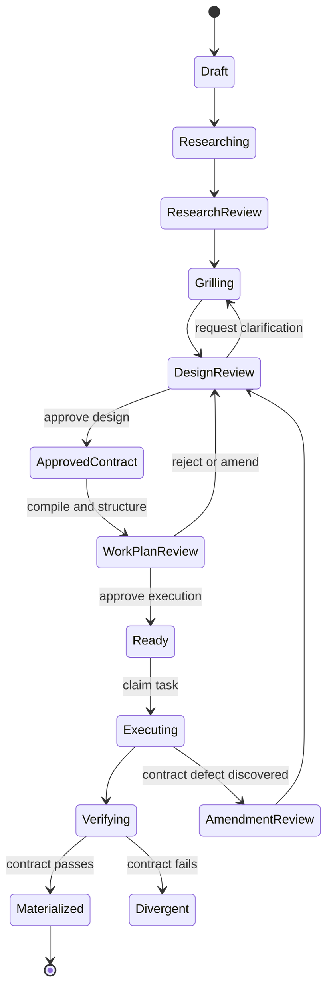
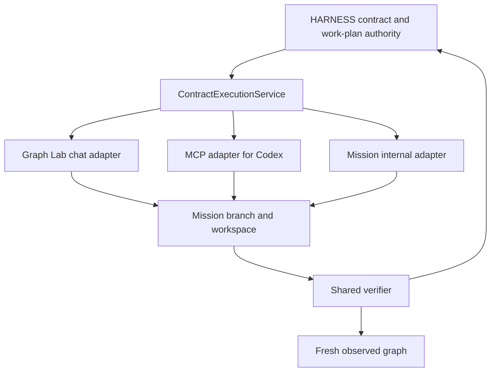

# Contract-driven execution across Graph Lab, MCP, and HARNESS

Status: Draft for architectural review
Date: 2026-08-15
Scope: `hero-graph-lab` design proposals and HARNESS mission execution
Next step: Convert the approved decisions in this document into a
spec-driven-development package with requirements, decisions, acceptance tests,
traceability, and incremental commits.

This document is a design proposal. It does not authorize implementation and it
does not claim that the described target behavior exists today.

## 1. Executive conclusion

Graph Lab should become the visual editor for an implementation contract shared
by three execution channels:

1. the Graph Lab chat agent;
2. an external agent such as Codex through MCP;
3. the HARNESS Mission executor.

The three channels must not receive independently rewritten versions of the
design. They must consume the same approved contract snapshot, the same derived
work plan, and the same deterministic verification result.

Research and Grill remain necessary. Before Design Review, the graph is a
mutable design hypothesis that those phases can investigate and refine. The
graph becomes an implementation contract only when the human approves a design
revision after Grill. That approval binds the reviewed brief and design map into
one immutable baseline.

The proposed integration therefore preserves the existing reasoning flow:

```text
idea or brief seed
  -> Research
  -> Grill
  -> reviewed brief + reviewed design draft
  -> Design approval
  -> immutable contract snapshot
  -> ChangeSet
  -> Structure / WorkPlan
  -> execution approval
  -> SPEC / PLAN / IMPLEMENT / REVIEW
  -> contract reconciliation
```

## 2. Provenance and current-state boundary

The current-state description was verified against the local checkouts on
2026-08-15.

- `hero-graph-lab` was clean before this document was created.
- HARNESS contained pre-existing modified and untracked work, including the
  interactive control-plane implementation. HARNESS was inspected read-only and
  is not changed by this proposal.
- The interactive flow described below reflects the inspected working tree. It
  must not be presented as a released or production-verified capability until
  its own branch, commits, and end-to-end evidence are established.

### 2.1 Inspected code anchors

The current-state analysis is grounded in these implementation boundaries:

- HARNESS `application/preparation_coordinator.py`: idea capture, Research,
  Grill, Design Review, approval, Structure, and execution approval;
- HARNESS `application/pipeline_definitions.py`: mission and task phase order;
- HARNESS `application/phase_registry.py`: artifacts injected into SPEC, PLAN,
  IMPLEMENT, bursts, and REVIEW;
- HARNESS `application/design_approval.py` and `application/plan_compiler.py`:
  approved snapshot and ChangeSet creation;
- HARNESS `domain/reconciliation.py`: current materialization states and merge
  gate behavior;
- Graph Lab `explore/service.py` and `explore/tools.py`: chat proposal contract;
- Graph Lab `static/mission.js`: design synchronization into HARNESS;
- Graph Lab `mcp_server.py`: external MCP transport.

## 3. Terminology

### Design draft

A mutable graph revision containing observed elements, proposed additions,
changes, removals, relationships, interface declarations, and rationale. It is
reviewable but not yet binding.

### Brief seed

Initial human input describing the desired outcome. It may be a short idea, a
task string, or an already detailed document supplied by the user. It is input
to Research and Grill and is not automatically an approved brief.

### Approved brief

The mission-level statement of objective, behavioral decisions, constraints,
and acceptance intent after Research and Grill. In the current interactive
flow, Grill writes `brief.md`.

### Contract snapshot

An immutable approved pairing of:

- one design revision;
- one approved brief revision;
- the observed graph revision and Git commit against which the design was
  reviewed;
- stable identifiers linking brief requirements to design nodes and relations.

### ChangeSet

The deterministic compilation of a contract snapshot into operations such as
create node, modify node, remove node, connect, and disconnect.

### WorkPlan

The grouping of every ChangeSet operation into deliverable tasks with exact
coverage, dependencies, complexity, and target contract nodes.

### Task contract slice

The bounded part of the approved contract and ChangeSet required for one task.
It is the normative context given to SPEC, PLAN, IMPLEMENT, REVIEW, the chat
executor, and the MCP executor.

### Materialized node

A contract node whose required structure is present in the freshly extracted
code graph and whose required behavioral checks pass.

## 4. Verified HARNESS flow and the role of `brief.md`

### 4.1 Interactive worker flow inspected on 2026-08-15

The interactive coordinator currently represents the following stages:

| Stage | Primary input | Produced or changed artifact | Contract meaning |
|---|---|---|---|
| Draft | Human idea | `idea.md` | No contract exists yet |
| Research | Mission task, idea, source, observed graph, current design map | `brainstorm.md` and design proposals | Mutable design hypothesis |
| Research Review | Brainstorm and design draft | Human review | Still non-binding |
| Grill | Brainstorm, graph, human answers | `brief.md` and updated design map | Ambiguities and design conflicts are resolved |
| Design Review | Brief plus design revision | Human review | Candidate contract |
| Approve Design | Design revision and observed revision | `approved_snapshot.json` and `changeset.json` | Contract becomes immutable |
| Structure | Brainstorm, approved brief, ChangeSet | `tasks.json` | Every operation must be covered exactly once |
| WorkPlan Review | Tasks and dependencies | Human review | Candidate execution plan |
| Approve Execution | Snapshot and mission document revisions | `execution_approval.json` | Implementation is authorized |
| Task Preparation | Task and approved mission context | `spec.md`, `plan.md`, `decisions.md` | Task contract is elaborated, not replaced |
| Execute and Review | Task artifacts and source | Code, status, audit | Contract implementation attempt |
| Reconcile | Fresh code graph, ChangeSet, completed tasks | `reconciliation.json` | Materialized, pending, divergent, or unverifiable |

### 4.2 Clarification about an initial `brief.md`

In the inspected interactive path, the first persisted human document is
`idea.md`; `brief.md` is produced by Grill. The classic CLI path starts from a
mission task string and follows Research, optional Grill, and Structure.

If a user supplies a mature `brief.md` before Research, it should not silently
occupy the same semantic position as Grill's approved output. The proposed
normalization is:

- preserve the supplied document as `brief-seed.md`, or import its content as
  the mission idea while retaining its provenance;
- let Research test its assumptions against source and graph evidence;
- let Grill confirm, amend, or reject its decisions;
- generate a distinct approved `brief.md` revision at Design Review.

This prevents an input document from being mistaken for a reviewed decision
record while still avoiding needless re-entry of a detailed brief.

An explicit future fast path may accept a supplied brief as already reviewed,
but only with a separate human action such as **Accept as review baseline**. It
must still pass design consistency checks before contract approval.

## 5. Proposed authority model

Authority changes by lifecycle state; no single artifact is authoritative for
everything.

| Concern | Authority | Notes |
|---|---|---|
| Current implemented code | Repository source and freshly observed graph | The graph is a derived observation, not desired design |
| Pre-approval design | Graph Lab design draft / HARNESS design revision | Mutable and reviewable |
| Mission intent and behavioral decisions | Approved brief revision | Must use stable requirement identifiers |
| Desired structure and interfaces | Approved contract snapshot | Immutable for one execution baseline |
| Required implementation operations | Deterministically compiled ChangeSet | Must not be invented independently by agents |
| Task decomposition | Approved WorkPlan | Must cover every operation exactly once |
| Task-level requirements | Task contract slice plus SPEC | SPEC may elaborate but not contradict the snapshot |
| Implementation strategy | PLAN | Non-normative when it conflicts with the contract |
| Completion | Shared verifier and reconciliation result | Agent self-report is evidence, not authority |

If the approved brief and contract snapshot contradict one another, execution
must stop. The conflict cannot be resolved by choosing whichever artifact the
agent happens to read last.

## 6. Proposed lifecycle



The important boundary is `DesignReview -> ApprovedContract`. Research and
Grill are allowed to change the design draft. SPEC, PLAN, and implementation are
not allowed to change the approved contract silently.

An amendment creates a new contract revision. It never mutates the snapshot
against which an execution already started.

## 7. Contract content

### 7.1 Mission-level references

The approved brief should assign stable identifiers to testable decisions and
requirements, for example `BR-001`, `BR-002`, and `BR-003`. Contract nodes and
relations declare which brief requirements they satisfy.

This produces the trace:

```text
brief requirement
  -> contract node or relation
  -> ChangeSet operation
  -> WorkPlan task
  -> task SPEC acceptance criterion
  -> implementation change
  -> verifier evidence
```

### 7.2 Minimal node contract

The first iteration should add only fields that materially improve execution
and deterministic verification:

- exact `kind`: package, module, class, function, or method;
- `target_path` or an equivalent intended source location;
- `qualified_name`;
- parent contract node;
- responsibility description;
- declaration or signature;
- docstring;
- required base classes where applicable;
- linked brief requirement identifiers;
- structural acceptance rules;
- behavioral acceptance criteria.

Methods and functions remain graph nodes. A class does not duplicate complete
method definitions inside an opaque class body.

Example:

```yaml
id: contract-node:telegram-gateway
kind: class
target_path: src/app/telegram/gateway.py
qualified_name: TelegramGateway
parent_id: contract-node:telegram-module
description: Transport boundary for Telegram.
docstring: Send notifications and receive normalized commands.
satisfies: [BR-002]
acceptance:
  - No Telegram SDK type escapes the adapter boundary.
```

```yaml
id: contract-node:send-notification
kind: method
parent_id: contract-node:telegram-gateway
signature: 'send_notification(self, chat_id: str, text: str) -> str'
docstring: Send a notification and return its provider message identifier.
satisfies: [BR-002]
acceptance:
  - Provider failures are converted into TelegramTransportError.
```

### 7.3 Interface preview without source mutation

Graph Lab should render a stub-like preview generated from node contracts:

```python
class TelegramGateway:
    '''Send notifications and receive normalized commands.'''

    def send_notification(self, chat_id: str, text: str) -> str:
        '''Send a notification and return its provider message identifier.'''
        ...
```

This preview is not written to the repository during design. Writing incomplete
source before approval would make proposed structures appear observed, pollute
the implementation branch, and create two competing representations of the
same interface.

## 8. Integration with each HARNESS stage

### 8.1 Before Research

Graph Lab proposals created by a human, the chat agent, or Codex through MCP are
design-draft inputs. They may be attached to a mission, but they are not an
implementation authorization.

The mission records:

- brief-seed or idea revision;
- starting design revision;
- observed graph revision;
- starting Git commit;
- proposal provenance.

### 8.2 Research

Research receives:

- the brief seed or idea;
- source and observed graph evidence;
- the complete current design draft;
- unresolved contract fields and design questions.

Research may add or amend proposals. It must distinguish observed facts from
recommended design and record why a proposed interface is needed. Research
does not approve the contract.

### 8.3 Grill

Grill uses the design draft as part of the conversation. Its questions should
target unresolved decisions such as:

- ownership and package placement;
- public interface boundaries;
- signatures and failure semantics;
- external dependencies;
- behavior that requires an acceptance criterion;
- contradictions between the graph and the brief.

When the human answers, Grill updates both the brief and the corresponding
design nodes or relations. Design Review is unavailable while deterministic
brief-to-contract consistency checks fail.

### 8.4 Design Review and approval

The user reviews two synchronized views:

1. the approved-brief candidate: why and expected behavior;
2. the graph contract candidate: what structure and interfaces shall exist.

Approval creates an immutable snapshot containing both revision references,
the observed baseline, and provenance. The ChangeSet compiler runs only from
that snapshot.

### 8.5 Structure and WorkPlan Review

Structure receives the ChangeSet and groups operations into tasks. It may
choose task boundaries, titles, dependencies, and complexity, but it may not
drop, duplicate, or rewrite operations.

Each task must contain:

- exact `covers` operation identifiers;
- exact `target_nodes` contract identifiers;
- dependencies derived from contract relationships and delivery needs;
- a generated task contract slice.

Execution approval pins the WorkPlan, contract snapshot, document revisions,
branch, and base commit.

### 8.6 SPEC and PLAN

SPEC receives the task contract slice directly, in addition to the brief and
context documents. It translates behavioral acceptance criteria into precise
task checks but cannot weaken structural obligations.

PLAN decides how to implement the task. It cannot rename a required symbol,
change its signature, move its target path, or discard a relation without an
amendment.

If SPEC or PLAN discovers that the contract is impossible or internally
inconsistent, the task pauses and requests an amendment. It does not silently
repair the approved design in prose.

### 8.7 IMPLEMENT and REVIEW

Every implementation channel receives the same task contract slice and
execution identity. The implementer reports changed files and tests, but cannot
declare the contract satisfied.

Review receives the same slice and the verifier output. Review may add quality
findings, but it cannot override a deterministic structural failure.

### 8.8 Reconciliation

After implementation, HARNESS rebuilds the observed graph and runs the common
contract verifier. The result is stored against the contract snapshot, task,
execution actor, and Git commit.

Only verified elements transition from proposed to materialized in Graph Lab.

## 9. One execution core, three channels



HARNESS owns the contract domain and lifecycle. Graph Lab does not reimplement
approval, task coverage, or reconciliation rules. The MCP server translates
tool calls but does not become a second contract store.

### 9.1 Graph Lab chat executor

The chat gains an explicit `Implement` mode, separate from `Explore` and
`Propose`. Entering this mode is a deliberate authorization, not a keyword
inference.

In the first iteration, Chat may implement only when:

- a mission is active or resumable;
- the contract and WorkPlan are approved;
- the mission is ready for the selected task;
- no other executor owns the execution lease;
- the active project and branch match the mission workspace.

The chat adapter exposes bounded contract, file-patch, check, and completion
tools backed by the shared execution service.

### 9.2 Codex through MCP

MCP exposes the contract control plane to external agents. Candidate tools are:

- `ContractListTasks`;
- `ContractGetTask`;
- `ContractBeginExecution`;
- `ContractValidate`;
- `ContractComplete`;
- `ContractReportBlocker`;
- `ContractProposeAmendment`.

Codex may edit with its native workspace tools while MCP supplies the pinned
contract and records the execution lifecycle. A later stricter mode may add
`ContractApplyPatch`, but a generic shell or unrestricted filesystem API should
not be introduced merely to duplicate capabilities Codex already has.

Completion through MCP succeeds only when the common verifier passes against
the recorded Git state. A textual claim from Codex is not sufficient.

### 9.3 Mission executor

Mission calls the same domain service directly in process. It should not call
its own MCP adapter, because doing so would add a transport dependency and a
possible Graph Lab/HARNESS lifecycle cycle.

The existing task loop remains the orchestration mechanism. The required change
is that SPEC, PLAN, IMPLEMENT, bursts, REVIEW, and reconciliation all receive or
resolve the same task contract slice.

## 10. Execution ownership and concurrency

Supporting three channels does not imply that they should edit the same mission
simultaneously.

The minimal safe policy is one active execution lease per mission:

- `execution_id`;
- actor: chat, MCP client, or Mission;
- contract snapshot and task;
- branch and base commit;
- lease start and heartbeat;
- observed changed files;
- final commit and verifier result.

Another actor may inspect the task while the lease is held, but may not start a
second implementation. A controlled hand-off releases one actor and records the
next. Task-level parallel leases can be considered later only after isolated
worktrees and merge semantics are proven necessary.

This single-lease first iteration deliberately avoids premature distributed
scheduling.

## 11. Shared verification

### 11.1 Structural contract

A language-aware verifier should check, initially for Python:

- target module or package exists;
- expected symbol exists at the intended path;
- exact node kind is correct;
- parent and qualified name are correct;
- function or method signature matches;
- required annotations are present;
- required docstring is present;
- required inheritance is present;
- deterministically observable relations are satisfied.

The observed graph remains a useful index, but AST or equivalent language
analysis is the evidence for signature-level checks.

### 11.2 Behavioral contract

Behavioral acceptance relies on declared checks:

- focused unit or integration tests;
- static analysis or type checking where configured;
- contract-specific test commands;
- reviewer evidence for properties that cannot be automated.

Docstrings explain intent but do not prove behavior.

### 11.3 Relation verification levels

Relations should declare their verification level rather than all being treated
as equally enforceable:

- hard-verifiable initially: `contains`, resolved `imports`, `inherits`;
- verifiable when the analyzer resolves evidence: `calls`, `references`;
- advisory until a domain-specific validator exists: `uses`, `publishes`, and
  custom semantic relationships.

An advisory relation remains part of the reviewed architecture but cannot be
reported as deterministically materialized.

### 11.4 Completion gate

The initial gate should block completion when:

- an approved operation is uncovered;
- a required locator cannot be derived;
- a required structural element is absent or mismatched;
- a hard-verifiable relation fails;
- a required check fails;
- the implementation is based on a different contract revision or base commit;
- an amendment is pending.

`UNVERIFIABLE` must not silently count as success for a required structural
obligation.

## 12. Amendments

Any executor may discover that a contract is incomplete or wrong. It may propose
an amendment but cannot apply it while implementing.

The amendment flow is:

1. pause the current task;
2. record the blocker and affected contract identifiers;
3. return to Amendment Review;
4. update brief and design draft together;
5. approve a new snapshot;
6. recompile the ChangeSet and revalidate the WorkPlan;
7. explicitly migrate or replace affected tasks;
8. resume against the new revision.

The old snapshot and its partial execution evidence remain available for audit.

## 13. Proposed decisions for review

These decisions are proposed, not yet accepted.

### CDE-D001 - Approve the contract after Grill

Research and Grill may refine the design draft. The human approves the contract
at Design Review, after the brief and map agree.

Alternative rejected: approving the graph before Research would freeze an
untested architectural hypothesis and turn discovery phases into compliance
theater.

### CDE-D002 - Bind brief and design in one snapshot

The contract snapshot references the approved brief revision and the approved
design revision. Neither can change independently during execution.

Alternative rejected: treating the graph as the only contract would lose
behavioral intent; treating the brief as the only contract would lose exact
structure and interfaces.

### CDE-D003 - Keep HARNESS as contract authority

HARNESS owns approval, snapshot, ChangeSet, WorkPlan, execution lease, and
reconciliation. Graph Lab edits and visualizes; MCP transports external agent
operations.

Alternative rejected: separate chat, MCP, and Mission contract stores would
create drift and conflicting completion states.

### CDE-D004 - Require a mission for implementation

Graph proposals may exist outside a mission, but implementation requires an
active or resumable mission with approved design and execution baselines.

Alternative rejected for the first iteration: a second standalone execution
lifecycle in Graph Lab would duplicate HARNESS.

### CDE-D005 - Use one task contract slice everywhere

SPEC, PLAN, all implementers, REVIEW, and reconciliation consume the same
generated slice. Intermediate prose may elaborate but cannot replace it.

### CDE-D006 - Render interface previews without writing stubs

Graph Lab renders Python-like declarations from structured node contracts.
Source files remain unchanged until implementation begins.

### CDE-D007 - Start with one execution lease per mission

Chat, Codex, and Mission can take turns implementing, but cannot concurrently
mutate the same mission workspace in the first iteration.

### CDE-D008 - Share domain services, not transports

Chat uses an in-process adapter, MCP uses a protocol adapter, and Mission calls
the service directly. Mission does not depend on MCP availability.

## 14. Risks and safeguards

| Risk | Safeguard |
|---|---|
| Contract becomes stale as code changes | Pin observed revision and base commit; require revalidation |
| Agents implement different interpretations | Generate and inject one task contract slice |
| Detailed contracts suppress useful discovery | Keep the draft mutable through Research and Grill |
| Interface preview is mistaken for implementation | Never write preview stubs during design; use explicit proposed state |
| Chat gains unsafe write authority | Explicit Implement mode, project containment, approved mission, execution lease |
| External Codex bypasses lifecycle with native edits | Validate recorded Git diff and commit before completion |
| Mission prose drifts from the map | Brief-contract consistency gate and amendment flow |
| `UNVERIFIABLE` produces false confidence | Block required structural obligations without evidence |
| Three channels edit concurrently | Single mission execution lease initially |
| HARNESS working-tree changes are mistaken for released state | Preserve provenance and run dedicated integration/E2E validation later |

## 15. Acceptance scenarios for the later specification

The SDD package should turn at least these scenarios into traceable acceptance
tests.

1. A detailed brief seed enters Research and remains distinguishable from the
   approved brief produced after Grill.
2. Research modifies a design draft without creating an implementation
   contract.
3. Grill changes a signature after a human answer and keeps the brief and graph
   consistent.
4. Design approval produces a snapshot containing exact brief and design
   revisions, observed revision, and base commit.
5. Structure covers every ChangeSet operation exactly once and generates a task
   contract slice.
6. Mission IMPLEMENT receives that slice verbatim.
7. Chat Implement mode receives the same slice and cannot start without
   execution approval.
8. Codex retrieves the same slice through MCP and records an execution identity.
9. A second executor is refused while the mission lease is active.
10. A deliberately incorrect signature is rejected for Chat, MCP, and Mission
    execution paths by the same verifier.
11. A correct signature and docstring become materialized after fresh graph
    extraction.
12. A failed behavioral test blocks completion even when the interface exists.
13. An executor requests an amendment and cannot silently change the contract.
14. A new approved revision preserves the old snapshot and execution evidence.
15. Playwright shows the same contract revision, task ownership, validation
    status, and materialized graph state that HARNESS reports.

## 16. Incremental implementation sequence

The later SDD process should keep the increments independently reviewable.

### Increment 1 - Contract schema and artifact boundaries

- exact node kind, target path, signature, docstring, brief requirement links;
- explicit brief-seed versus approved-brief semantics;
- immutable contract snapshot schema;
- no executor changes yet.

### Increment 2 - Task contract compilation

- enrich ChangeSet operations;
- generate task contract slices;
- validate complete coverage and contract consistency;
- inject slices into SPEC and PLAN first.

### Increment 3 - Mission enforcement

- inject the slice into IMPLEMENT, bursts, REVIEW, and reconciliation;
- implement Python structural verification;
- make required `UNVERIFIABLE` results blocking.

### Increment 4 - MCP contract control plane

- read tasks and contract slices;
- begin, validate, complete, block, and amend execution;
- validate with a real MCP client before claiming Codex integration.

### Increment 5 - Graph Lab Chat Implement mode

- explicit authorization and mission checks;
- bounded patch and check tools;
- execution progress in the existing chat;
- no inferred write mode from natural-language keywords.

### Increment 6 - Rendered contract UX and three-path E2E

- interface preview;
- contract revision and executor status;
- proposal-to-materialized transition;
- Playwright validation of Chat, MCP, and Mission paths.

## 17. Non-goals for the first implementation

- Generating complete business logic during proposal creation.
- Writing `.py`, `.pyi`, or other source stubs before execution approval.
- Concurrent multi-agent editing of one mission workspace.
- A generic remote shell exposed through MCP.
- Replacing Research, Grill, SPEC, PLAN, or REVIEW with the graph.
- Treating every semantic relationship as deterministically verified.
- Supporting every programming language in the first verifier.

## 18. Questions requiring approval before SDD

1. Should a user-supplied mature brief be preserved as `brief-seed.md`, or
   should the existing `idea.md` alias hold that content with provenance?
2. Is one active executor per mission acceptable for the first iteration?
3. Should the first structural verifier target only Python, matching the current
   Graph Lab extractor?
4. Which annotations are contractual: all annotations in the signature, or only
   parameter names and arity in the first iteration?
5. Should docstring text match exactly, or should the gate require presence
   while treating wording as reviewable?
6. Which relationship kinds should be hard gates in the first iteration?
7. May Codex use native file tools while MCP owns lifecycle and validation, or
   is `ContractApplyPatch` required from the first MCP increment?

Once these questions and proposed decisions are reviewed, the next artifact
should be a new SDD package rather than direct code changes.
